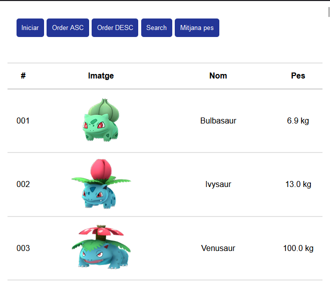
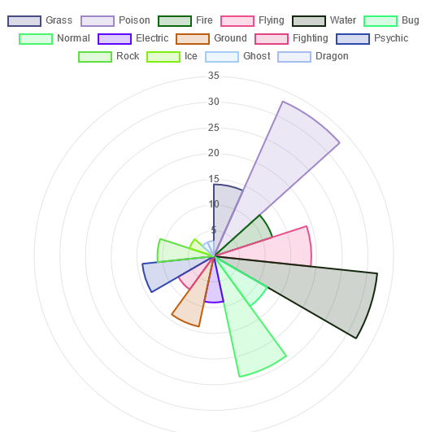
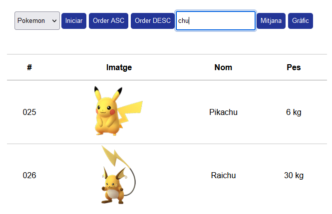
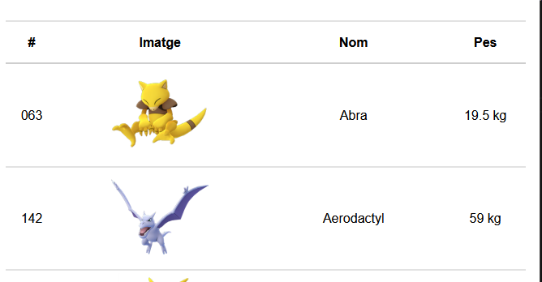
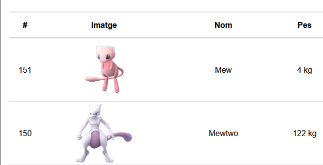

# UF2 Projecte Arrays

### Pràctica amb Arrays: Dades massives

#### **Part 0.** Accedir al JSON i començar a llistar dades

Recorrent tot el json fes un console.table de les següents dades:

| Pokemon | Municipis       | Pel·lícules | EarthMeteorite |
|---------|-----------------|-------------|----------------|
| name    | municipi_nom    | title       | name           |

#### **Part 1.** Funcions i arrays

Crea les següents funcions:

* **orderList**: La funció haurà de retornar l’array ordenada de manera ascendent o descendent en funció del que se li passi per paràmetre.

* **searchList**: Retorna la posició d’un element buscat mitjançant un prompt.

* **calcMitjana**: Calcula la mitjana de un valor numèric.

* **printList**: Crea una taula i mitjançant el DOM mostris el resultat en el div resultat.

#### **Part 2.** Creem un gràfic

A través de la llibreria Chart.js crearem un gràfic que ens mostrarà els pokemons en funció del seu tipus.

#### **Part 3.** Modifiquem les funcions per a que funcionin en arrays multidimensionals

**Search**

La funció search a mida que anem escrivint en el camp de cerca ens vagi mostrant els diferents elements.

**Order by**

A la taula els ***thead*** són clicables, quan es fa clic s'ordenan ascendent i descendent.

**Sort by name:**

**Sort by id:**
